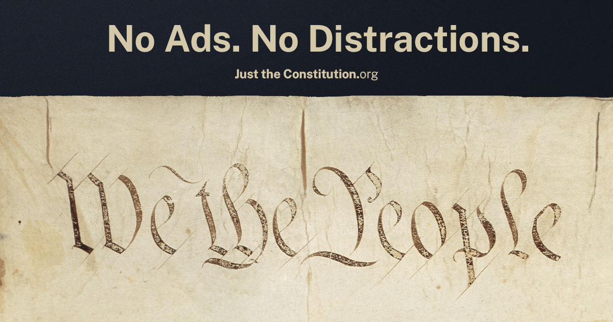

# Just the Constitution

**Ratified in 1788. Built for 2026.**

**Live site: [justtheconstitution.org](https://justtheconstitution.org)** · [Español](https://justtheconstitution.org/es/)

Just the Constitution is a clean, modern web edition of the United States
Constitution and all twenty-seven amendments. Every line is citeable,
shareable, and searchable. No ads. No commentary. No paywall.



## Features

- **Full text, faithfully transcribed** — Articles I–VII preserve the original
  1787 spelling, capitalization, and punctuation as inscribed by Jacob Shallus
  on the parchment.
- **Line-level deep links** — every paragraph has a stable anchor. Share a
  clause, not a homepage.
- **Citation engine** — copy any paragraph as a formatted citation in
  Bluebook, MLA, Chicago, Markdown, or BibTeX. The article, section, and
  clause are identified automatically.
- **Original parchment, side by side** — high-resolution National Archives
  facsimiles paired with the text.
- **English and Spanish** — full parity, validated at build time.
- **Full-text search**, dark mode, reader mode, keyboard shortcuts, and a
  Markdown download of the complete document.
- **[For educators](https://justtheconstitution.org/en/for-educators/)** — a
  dedicated page for classroom use.

## Privacy

No ads. No cookies. No accounts. The only measurement is Cloudflare Web
Analytics — cookie-free, anonymized, aggregate page counts — disclosed in
full at [/info/](https://justtheconstitution.org/en/info/). Reading position
and display preferences live in your browser's local storage and never leave
your device.

## How it's built

No framework. Plain HTML, CSS, and JavaScript assembled by a custom build
script:

- `build.js` generates the site from `index.template.html`, `templates/`,
  and per-locale string tables in `data/` (`strings.en.js` / `strings.es.js`,
  `constitution.js` / `constitution.es.js`).
- The build validates EN/ES structural parity (same articles, sections, and
  paragraphs) and injects meta tags, JSON-LD, sitemaps, and cache-busting
  hashes.
- Generated output (`index.html`, `en/`, `es/`, `404.html`, minified assets)
  is committed alongside source. **Edit source, not generated files** — the
  next build overwrites them.

```
npm install
node build.js
```

Deployed on Cloudflare Workers as static assets.

## Text provenance

- Articles I–VII and signatures: transcribed from the
  [National Archives](https://www.archives.gov/founding-docs/constitution-transcript).
- Amendments I–XXVII: [National Constitution Center](https://constitutioncenter.org/the-constitution/full-text).
- Both sources were compared during the build; no substantive discrepancies
  were found.
- Parchment scans: [National Archives downloads](https://www.archives.gov/founding-docs/downloads).

This is an independent project. It is not affiliated with or endorsed by any
government agency.

## Feedback and support

The site is in beta ahead of a full release on Constitution Day,
September 17, 2026.

- **Feedback**: the [contact form](https://justtheconstitution.org/en/info/)
  (with categories for bugs, content, and accessibility) or
  [feedback@justtheconstitution.org](mailto:feedback@justtheconstitution.org).
- **Support**: the site is built and maintained by one person and is
  self-funded. If it's useful to you, [Ko-fi](https://ko-fi.com/justtheconstitution)
  contributions cover the domain and email. Everything else is donated time.

## License

Code is [MIT](LICENSE). The text of the Constitution is public domain.
